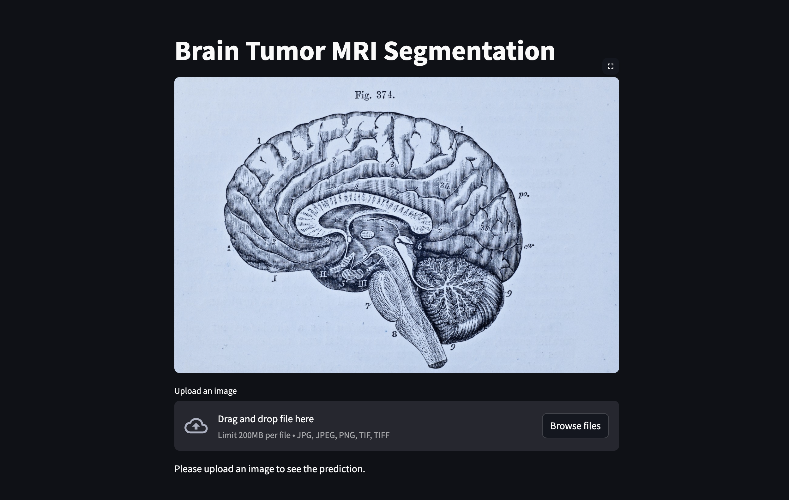
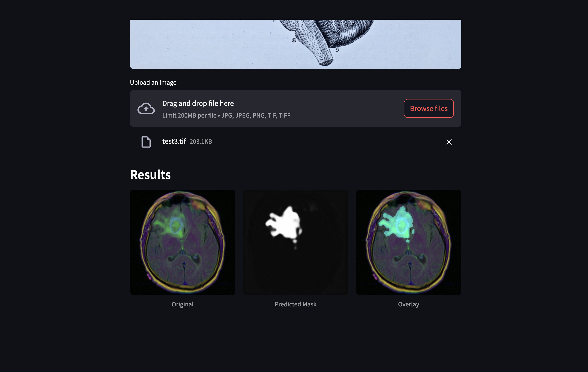

# 🧠 Brain Tumor Segmentation

This project focuses on brain tumor segmentation using deep learning techniques, specifically leveraging a fine-tuned **UNet architecture**.

## 📌 Requirements

All necessary dependencies can be installed using the `requirements.txt` file:

```bash
pip install -r requirements.txt
```

## 📂 Dataset

The dataset used for this project can be accessed via [Kaggle](https://www.kaggle.com/datasets/mateuszbuda/lgg-mri-segmentation). It contains MRI scans with corresponding tumor segmentation masks.

## 🏗 Model

A **UNet model** was fine-tuned on the above dataset for tumor segmentation. The trained model is available in this repository:

📍 [Best Model Checkpoint](./saved_model/best-model.pth)

## 🎨 Graphical User Interface (GUI)

To run the GUI, follow these simple steps:

1️⃣ Clone this repository:

```bash
git clone https://github.com/your-repo/brain-tumor-segmentation.git
cd brain-tumor-segmentation
```

2️⃣ Install dependencies:

```bash
pip install -r requirements.txt
```

3️⃣ Run the GUI using **Streamlit**:

```bash
streamlit run main.py
```

### 📸 Snapshots

| Home Screen | Output Screen |
|------------|--------------|
|  |  |

## 📚 Training

For training details, refer to the **[Training Notebook](main_notebook.ipynb)**.

---

🚀 **Contributions are welcome!** Feel free to submit issues or pull requests.

⭐ **If you find this project useful, consider giving it a star!**


